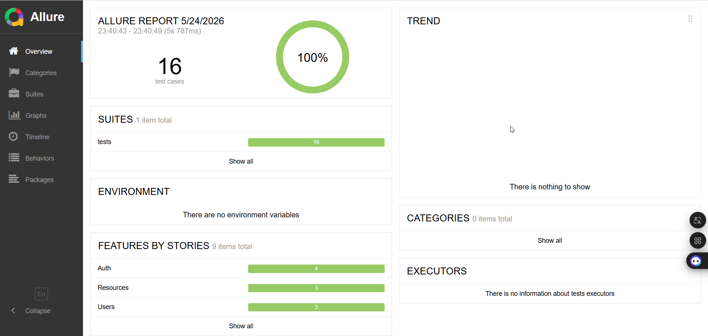

## 📋 Что тестирует проект

Проект содержит автоматические API-тесты для сервиса [ReqRes](https://reqres.in) (имитация REST API для тестирования). Тестируются следующие эндпоинты:

- `GET /users` – получение списка пользователей
- `GET /users/{id}` – получение одного пользователя
- `POST /users` – создание пользователя
- `PUT /users/{id}` – полное обновление
- `PATCH /users/{id}` – частичное обновление
- `DELETE /users/{id}` – удаление пользователя
- `POST /register` – регистрация
- `POST /login` – логин

Проверяются: статус-коды, структура JSON (схемы), корректность данных, негативные сценарии.

## 🛠 Технологии

- **Python** 3.10+
- **Requests** – HTTP-клиент
- **Pytest** – фреймворк для тестирования
- **Allure** – генерация отчётов
- **Docker** + **Docker Compose** – контейнеризация
- **GitHub Actions** – CI/CD
- **GitHub Pages** – публикация отчётов

# Структура проекта:

```text
reqres_in/
├── requirements.txt # зависимости проекта
├── conftest.py # фикстуры (клиент, токен, окружение)
├── pytest.ini # настройки pytest
├── .env / .env.example # переменные окружения
├── config/
│ ├── environments.py # настройки окружений (dev/stage/prod)
│ └── application.py # конфигурация приложения
├── services/
│ ├── base_api.py # базовый HTTP-клиент
│ └── reqres_in/
│ ├── auth/ # методы для регистрации/логина
│ │ ├── auth.py
│ │ ├── login_user.py
│ │ ├── register_user.py
│ │ └── models/ # схемы ответов
│ ├── resources/ # методы для работы с ресурсами
│ │ ├── resource.py
│ │ ├── get_resource.py
│ │ ├── get_resources.py
│ │ └── models/
│ └── users/ # CRUD для пользователей
│ ├── users.py
│ ├── create_user.py
│ ├── delete_user.py
│ ├── get_user.py
│ ├── get_users.py
│ ├── update_user_put.py
│ ├── update_user_patch.py
│ └── models/
├── tests/ # тесты
│ ├── test_auth.py
│ ├── test_create_user.py
│ ├── test_user.py
│ ├── test_resources.py
│ ├── test_mock.py
│ └── test_pytest_get_user.py
├── utils/
│ └── helper.py # вспомогательные функции
├── allure-results/ # результаты тестов (генерируется)
├── docker-compose.yml
├── Dockerfile
└── README.md
```

## 🚀 Quick start

### 1. Клонировать репозиторий
```bash
git clone https://github.com/ilmira/reqres_in
cd reqres_in
```

### 2. Установить зависимости
```bash
pip install -r requirements.txt
```
### 3. Настроить переменные окружения

Создать файл .env:

```
# .env.example
API_KEY=your_api_key_here
```

```bash
cp .env.example .env
```
### 4. Запуск тестов 

* DEV: 
```bash
pytest -sv --env=dev
```
* STAGE: 
```bash
pytest -sv --env=stage
```

## 🐳 Запуск API тестов в Docker

Для API тестов используется облегченный процесс, так как не требуется установка браузеров. Все зависимости и переменные окружения изолированы внутри контейнера.

### Основные команды


| Команда | Описание |
| :--- | :--- |
| `docker-compose up` | Собрать и запустить все API тесты |
| `docker-compose up --build` | Пересобрать образ (использовать при изменении кода или библиотек) |
| `docker-compose down` | Очистить контейнеры и временные сети |

### Гибкое управление запуском

Используйте `docker-compose run` для передачи специфических параметров pytest:

*   **Запуск тестов для конкретного окружения (dev/stage):**
    ```bash
    docker-compose run reqres-in pytest --env stage
    ```

### Отчеты и результаты
Результаты выполнения (логи и Allure-данные) синхронизируются с вашей локальной папкой:
- `./allure-results` — результаты тестов для генерации отчетов.

Чтобы посмотреть красивый отчет после тестов:
```bash
allure serve allure-results
```
## 📊 Пример Allure-отчёта



## CI/CD

Проект использует **GitHub Actions** для автоматического запуска тестов и публикации Allure‑отчёта на **GitHub Pages**.

### Триггер

Workflow запускается при создании Pull Request в ветку `main`.

### Что делает pipeline

| Джоба | Описание |
|-------|----------|
| `run-tests` | Запускает тесты через `docker compose up`, генерирует Allure‑отчёт и сохраняет его как артефакт сборки. |
| `prepare-pages` | Загружает артефакт с отчётом и подготавливает его для деплоя на GitHub Pages. |
| `deploy-to-pages` | Публикует отчёт на GitHub Pages и возвращает URL. |

### Как посмотреть отчёт

1. После завершения workflow перейдите в **Settings** → **Pages** вашего репозитория.
2. Там будет указана ссылка на опубликованный сайт (например, `https://<username>.github.io/<repo>/`).
3. Отчёт автоматически обновляется при каждом успешном запуске тестов.

### Настройка GitHub Pages (один раз)

Чтобы деплой работал, в настройках репозитория (`Settings` → `Pages`) выберите источник **"GitHub Actions"**. После первого запуска всё настроится автоматически.


